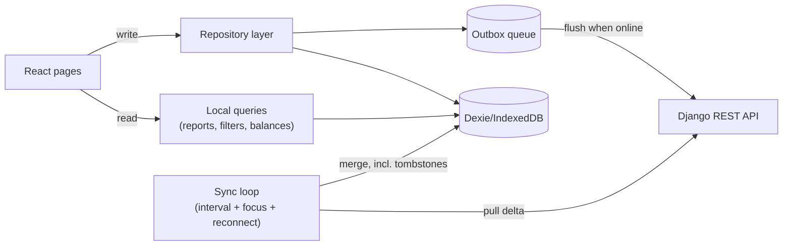

# v1.2 — Local-first data layer + UI redesign

## Architecture change (point 1): local-first reads, backend = sync + concurrency

Today every page calls the API per filter/navigation change (`frontend/src/pages/TransactionsPage.tsx`, `AccountDetailPage.tsx`, `ReportsPage.tsx`, `BudgetsPage.tsx`). A Dexie cache already exists (`frontend/src/db/index.ts`) but is write-only (populated by `/sync/`, never read from), and the `outbox` table is defined but never actually used by any mutation.

**Decision (confirmed):** optimistic local writes always; background sync to server; Last-Write-Wins by `updated_at` on conflict. No live round-trip required for a write to "succeed" locally.

### Backend changes
- **Soft delete / tombstones**: add `deleted_at` (nullable) to `TimestampedModel` in [backend/apps/ledger/models.py](backend/apps/ledger/models.py); update `UserScopedMixin`/viewsets in [backend/apps/ledger/views.py](backend/apps/ledger/views.py), [backend/apps/budgets/views.py](backend/apps/budgets/views.py), [backend/apps/planning/views.py](backend/apps/planning/views.py) to soft-delete (`deleted_at = now()`) instead of hard delete, and exclude soft-deleted rows from normal querysets.
- **`SyncView`** ([backend/apps/core/views.py](backend/apps/core/views.py)): include soft-deleted IDs per resource (`deleted_at__gt=since`) as `deleted_ids: {accounts: [...], transactions: [...], ...}` so other devices can remove them from Dexie. Keep existing incremental `updated_at__gt=since` payload for upserts.
- Migration for `deleted_at` across ledger/budgets/planning apps.
- No other backend logic changes needed for LWW — `updated_at`/`version` bump on save already gives the client what it needs to decide "last write wins" during merge (server's copy always wins by definition since it's the arrival order at the DB).

### Frontend changes
- Add `dexie-react-hooks` dependency for `useLiveQuery` so components reactively re-render when Dexie changes (no manual refetch after sync).
- New `frontend/src/data/` module:
  - `repository.ts` — `createTransaction/updateTransaction/deleteTransaction` (and same for account/category/tag/budget/planned): write to Dexie immediately (optimistic, with a temp negative id if offline-created), then either call the API directly (online) or `queueOutbox` (offline/failure), reconciling the temp id once the server responds.
  - `queries.ts` — pure functions over Dexie tables: `listTransactions(filters)`, `accountBalance(accountId)`, `categoryTree()`, etc. Transfers must match `account == X OR to_account == X` (fixes point 6 below).
  - `reports.ts` — port [backend/apps/core/views.py](backend/apps/core/views.py) `ReportSummaryView` aggregation and [backend/apps/budgets/models.py](backend/apps/budgets/models.py) `Budget.compute_status`/`period_bounds`/rollover logic to TypeScript, operating on local Dexie transactions.
- Rework [frontend/src/hooks/useOfflineSync.ts](frontend/src/hooks/useOfflineSync.ts) into the single sync loop: flush outbox, pull `/sync/` delta (including new `deleted_ids`), apply deletes+upserts to Dexie. Run on mount, on `online` event, on window focus, and on an interval (e.g. 60s) — not per navigation.
- Migrate all pages/modals off direct `api.*` calls for reads and writes: `TransactionsPage`, `AccountDetailPage`, `DashboardPage`, `ReportsPage`, `BudgetsPage`, `PlannedPage`, `CategoriesPage`, and all `*FormModal` components switch to the new repository/query functions.
- Backend REST endpoints stay as-is (still used by the repository layer/outbox when online) — no API surface removed, just no longer called from render paths.

## Point 2 — UI redesign (adopt screenshot's structural pattern)

- **Nav** ([frontend/src/components/AppHeader.tsx](frontend/src/components/AppHeader.tsx)): Dashboard, Transactions, Accounts, Reports, Budgets, Planned + a gear "Settings" entry. Remove Categories and Import as top-level items.
- **New Settings area**: `frontend/src/pages/SettingsPage.tsx` with sub-tabs for Categories & Tags (existing `CategoriesPage` content) and Import (existing `ImportPage`); add route `/settings` in [frontend/src/App.tsx](frontend/src/App.tsx).
- **Filter sidebar** ([frontend/src/components/TransactionFilters.tsx](frontend/src/components/TransactionFilters.tsx), [frontend/src/context/FilterSidebarContext.tsx](frontend/src/context/FilterSidebarContext.tsx)): restyle as icon-led collapsible groups (search, sort, accounts, categories, tags, amount range, transfers toggle, reset button) matching the screenshot's "Мой фильтр" panel.
- **Transaction list**: replace the flat table in [frontend/src/components/TransactionList.tsx](frontend/src/components/TransactionList.tsx) with a day-grouped card list — a header per calendar day showing the date and that day's net total, rows showing colored category icon, category/description, account (with colored dot), tag badges, right-aligned amount + time.
- **Date navigator**: see point 5 below — placed at the top of Transactions/Reports like the screenshot's "‹ This month ›".
- **Header actions**: prominent "+ Add" button and a user avatar/name menu (Settings, Logout) replacing the plain "Logout" button.
- Scope is pattern-adoption, not pixel-cloning: reuse existing dark theme tokens in [frontend/src/index.css](frontend/src/index.css), just restructure layout/components.

## Point 3 — Regional currency formatting everywhere

- Extend [frontend/src/utils/format.ts](frontend/src/utils/format.ts) with `formatCurrency(amount, currencyCode)` using `Intl.NumberFormat(locale, { style: "currency", currency: currencyCode })` (gives regional grouping/decimals plus the right symbol, e.g. ₽/$/€, driven by the active i18n locale from [frontend/src/i18n/index.ts](frontend/src/i18n/index.ts)).
- Replace every manual `formatNumber(...) + " " + currency_code` occurrence with `formatCurrency(...)`: [frontend/src/components/TransactionList.tsx](frontend/src/components/TransactionList.tsx), `DashboardPage.tsx`, `AccountsPage.tsx`, `AccountDetailPage.tsx`, `BudgetsPage.tsx`, `ReportsPage.tsx`, `PlannedPage.tsx`, `BudgetFormModal.tsx`.

## Point 4 — Category colors

- Backend: add `color` (hex, default `#6366f1`) to `Category` in [backend/apps/ledger/models.py](backend/apps/ledger/models.py) + migration + serializer field in [backend/apps/ledger/serializers.py](backend/apps/ledger/serializers.py).
- Rule: color picker shown only for top-level (`parent is None`) categories in `CategoryFormModal`; subcategories store their own `color` but the UI defaults/display it to the root ancestor's color (computed in [frontend/src/utils/categoryTree.ts](frontend/src/utils/categoryTree.ts) by walking to the root) unless explicitly overridden later.
- Use category color for: tree dots on the Categories settings tab, category icon backgrounds in the redesigned transaction list, and Reports "by category" doughnut segment colors (replacing the current single hardcoded color).

## Point 5 — Quick date-range filter (week/month/year + prev/next)

- New `frontend/src/hooks/useDateRangePeriod.ts` + `frontend/src/components/DateRangeNav.tsx`:
  - State: `periodType: "week" | "month" | "year" | "custom"`, `anchorDate`.
  - Derives `{from, to}` bounds; Prev/Next shift `anchorDate` by one unit; label shows localized range (e.g. "This month" / "В этом месяце").
- Wire into `TransactionsPage`, `AccountDetailPage`, `ReportsPage`, replacing their separate raw date inputs; feeds the local query/report functions from point 1.

## Point 6 — Transfers: show on both sides, always gray

- Query fix (point 1's `queries.ts`): matching transactions for account X must be `account == X OR to_account == X` (today [backend/apps/ledger/views.py](backend/apps/ledger/views.py) `TransactionViewSet.get_queryset` only matches `account_id`, so the destination leg never shows in the destination account's list).
- Color fix in [frontend/src/utils/transactionDisplay.ts](frontend/src/utils/transactionDisplay.ts) `formatSignedAmount`: for `tx.type === "transfer"`, always return the `amount-transfer` (gray) class regardless of perspective account — only the `+`/`-` sign should vary by direction; today it incorrectly returns green/red classes when viewed from a specific account's perspective.

## Point 7 — "Outside wallet" instead of separate to/from-nowhere selector

- Rework [frontend/src/components/TransactionFormModal.tsx](frontend/src/components/TransactionFormModal.tsx) transfer UI: two selects, "From account" and "To account", each listing real accounts plus a synthetic "Outside wallet" option (sentinel value). Remove the current separate "direction" selector.
- No backend/model change needed — purely a submit-time mapping to the existing fields: "Outside wallet" as To ⇒ `to_account=null, transfer_kind=to_nowhere`; "Outside wallet" as From ⇒ keep `account` = the real side, `to_account=null, transfer_kind=from_nowhere` (mirrors current `from_nowhere` semantics where `account` is the real account receiving funds). Validate that both sides aren't "Outside wallet" simultaneously.

## Suggested sequencing

1. **Foundations** (low risk, independent): point 3 (currency formatting), point 4 (category color model+UI), point 6 (transfer query/color bugs), point 7 (outside wallet UX).
2. **Shared widget**: point 5 (date range nav), used later by both Transactions/Reports and the redesigned UI.
3. **Data layer rework**: point 1 (Dexie repository/queries/reports, soft-delete sync, wiring pages off direct API calls) — the largest change, everything else in step 4 depends on it for performance/correctness.
4. **UI redesign**: point 2, built on top of the local query layer and date-range widget.
