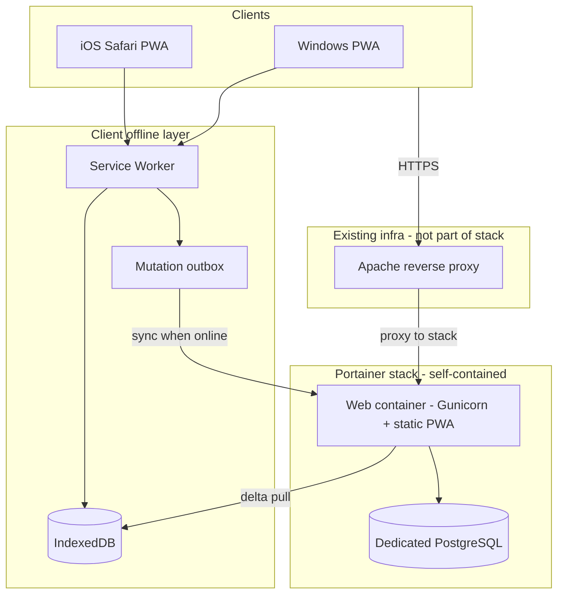
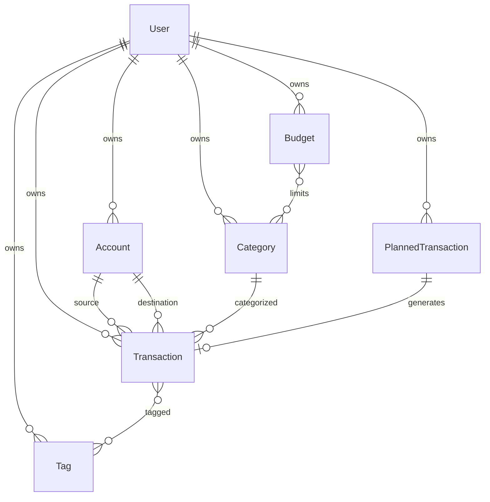
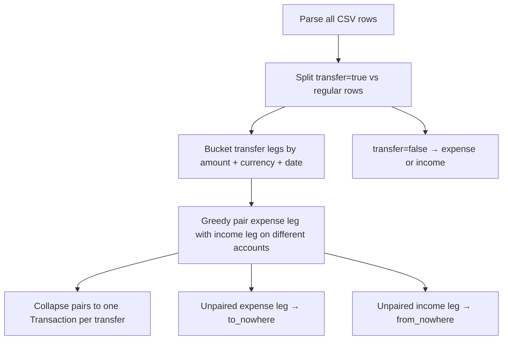

# Personal Finance App — Implementation Plan

## Recommended architecture (storage & sync)

**Use a self-hosted backend database + REST API + client-side cache.** Reject P2P and Nextcloud-as-primary-storage for this use case.

| Option | Verdict | Why |
|--------|---------|-----|
| **Backend DB + API + IndexedDB cache** | **Recommended** | Transactional integrity, queryable reports, simple conflict model |
| P2P sync | Not recommended | Still needs a relay server, hard conflict resolution |
| Nextcloud as primary storage | Not recommended | File/WebDAV sync is not transactional; reporting and concurrent edits become fragile |

**Backups:** Out of scope for the app. The Proxmox VM hosting the stack is already backed up at the infrastructure level — no in-app dump jobs or external backup targets.



**Sync model (simple and sufficient for personal finance):**
- Server is source of truth (dedicated PostgreSQL container in the same stack).
- Each entity has `updated_at` + monotonic `version` (or use `updated_at` + id cursor).
- Client stores a `last_synced_at` cursor; pulls `/api/sync/?since=...` on connect.
- Offline: UI reads IndexedDB; creates/updates go to a local **outbox** queue.
- On reconnect: push outbox (server validates), then pull deltas.
- Conflicts: **last-write-wins by server timestamp** per record (acceptable for single-user; log conflicts for audit if needed later).

**Multi-user advice:** Start **single-user** (one login = one dataset). Design schema with an optional `household_id` on all domain tables so a future “shared household budget” mode does not require a rewrite. Do not build multi-tenant admin, invitations, or per-user permissions in v1.

**Multi-currency (your choice):** v1 uses one base currency for display defaults. Store `currency_code` on `Account` and `Transaction` from the start (populated by WalletApp import) so multi-currency UI can follow later without schema changes.

---

## Tech stack (lightweight, fully encapsulated)

Build fresh in [`finance-control-2`](C:\Users\anpol\git\finance-control-2) (greenfield). The sibling [`finance-control`](C:\Users\anpol\git\finance-control) Django scaffold is incomplete — treat as reference only.

| Layer | Choice | Resource note |
|-------|--------|---------------|
| Backend | **Django 5 + DRF** | ~100–200 MB RAM with 2 Gunicorn workers |
| Auth | **JWT (SimpleJWT)** in httpOnly Secure cookies | Stateless — no Redis |
| Database | **Dedicated PostgreSQL 16 container** in the same stack | No shared DB instances across apps/VMs |
| Frontend | **React + Vite + TypeScript PWA** | Built to static files, served by the web container |
| Offline | **IndexedDB** (Dexie.js) + **Workbox** service worker | Read-only offline in v1; write-queue in a later phase |
| Deploy | **Docker Compose as Portainer stack** | 2 services: `web` + `db`; no host OS dependencies |
| Proxy | **Existing Apache** | App ships only an example vhost conf — no proxy container in stack |
| Scheduled jobs | **Deferred** | Only needed for planned-transaction autocommit (see phases) |

Estimated steady-state footprint: **~250–400 MB RAM** (web + dedicated Postgres). No Redis, no Node runtime in production, no job runner until autocommit phase.

**iOS without App Store:** Ship as a **PWA** — “Add to Home Screen” in Safari gives an app-like icon and full-screen UI.

**Remote access:** Public HTTPS via your existing Apache reverse proxy. Security hardening on the app side remains mandatory (see below).

---

## Deployment (Portainer stack)

The stack must be **self-contained and decoupled** — no shared PostgreSQL, no dependency on other containers or VMs beyond network reachability from Apache.

### Stack composition (2 services)

```yaml
# Conceptual — full file lives in deploy/docker-compose.yml
services:
  db:
    image: postgres:16-alpine
    volumes: [postgres_data]
    # internal network only — no host port publish required

  web:
    build: .   # multi-stage: frontend build + Django/Gunicorn
    environment: [DATABASE_URL, SECRET_KEY, ALLOWED_HOSTS]
    depends_on: [db]
    ports: ["8080:8000"]   # Apache proxies to this host:port
```

- **Web container** runs Gunicorn and serves the built PWA static files (WhiteNoise or equivalent).
- **DB container** is used exclusively by this app; data volume `postgres_data` travels with the stack.
- **Portainer:** deploy via “Add stack” → paste/upload `docker-compose.yml` + set env vars in the Portainer UI (or `.env` file reference).
- **Migrations:** web container entrypoint runs `migrate` on start (idempotent).
- **Initial user:** `manage.py seed_user` management command (run once via Portainer console or documented one-liner).

### Apache vhost (deliverable, not deployed by stack)

Ship [`deploy/apache-vhost.example.conf`](deploy/apache-vhost.example.conf) — you add this to your existing Apache:

- `ProxyPass /api/ http://<stack-host>:8080/api/`
- `ProxyPass / http://<stack-host>:8080/` (SPA + static)
- WebSocket not required for v1
- TLS termination stays on Apache (already configured)

No Nginx container, no Certbot, no proxy logic inside the app stack.

---

## Security (self-hosted, public HTTPS)

- TLS termination at existing Apache; HSTS if not already enabled globally.
- Strong auth: Argon2 passwords, rate-limited login; optional 2FA in a later phase.
- JWT in **httpOnly Secure cookies** (not localStorage).
- Django: `DEBUG=False`, strict `ALLOWED_HOSTS`, CSP headers.
- No third-party analytics, fonts, or CDNs — bundle everything locally.
- DB credentials in Portainer env / `.env`, never committed.
- Rate limiting on `/api/auth/` (Django middleware or Apache `mod_ratelimit`).
- VM-level Proxmox backup covers disaster recovery — no app-level backup jobs.

---

## Domain model (v1)



### Core entities

**Account**
- `title`, `icon` (emoji or icon key), `color` (hex), `sort_order`, `archived`, `currency_code`, `initial_balance`

**Category**
- `name`, `icon`, `type` (`expense` | `income`), optional `parent` for hierarchy

**Tag**
- `name`, `color` (optional)

**Transaction**
- `type`: `expense` | `income` | `transfer`
- `account` — primary account (source for outflows, destination for inflows)
- `to_account` — nullable; required only for account-to-account transfers
- `transfer_kind` — only when `type=transfer`:
  - `account_to_account` — `account` → `to_account` (both set)
  - `to_nowhere` — outflow from `account`; `to_account` is null (WalletApp “transfer to nowhere”)
  - `from_nowhere` — inflow to `account`; `to_account` is null (external deposit / untracked source)
- `amount` (positive decimal; WalletApp amounts imported as-is)
- `category` (nullable for transfers)
- `date`, `tags` (M2M), `notes`, `recipient` (payee), `status` (`pending` | `cleared` | `reconciled`)
- `payment_type` (optional — maps WalletApp `payment_type`, e.g. “Наличные”)
- `currency_code`, `ref_currency_amount` (from WalletApp; supports future multi-currency)
- `planned_transaction` FK (nullable)
- `import_source_id` (optional — dedup hash of source CSV row for re-import safety)
- `import_pair_id` (optional — UUID linking two WalletApp legs merged into one logical transfer)

**Budget**
- `name`, `amount`, `start_date`, `period` (`monthly` | `yearly`), `rollover_enabled`
- M2M to `Category`
- Computed spent/remaining per period in API

**PlannedTransaction** (later phase)
- Template fields mirroring Transaction
- `repeat_rule`, `next_occurrence_date`, `end_date` (optional)
- `autocommit` (bool) — **UI toggle in phase 3; server job that honors it in phase 5**
- Manual “commit now” works without any scheduler

### Business rules to implement early

**Transfers — single row per logical transfer** (not two legs like WalletApp):

| `transfer_kind` | Effect on balances |
|-----------------|-------------------|
| `account_to_account` | −amount on `account`, +amount on `to_account` |
| `to_nowhere` | −amount on `account` only |
| `from_nowhere` | +amount on `account` only |

- UI: transfer form supports optional destination — leave empty for “to nowhere” / “from nowhere” (direction chosen by which side is filled).
- Account balance = `initial_balance` + income − expense + transfer inflows − transfer outflows.
- Budget periods from `start_date` + `period` (custom cycles, not calendar-month-only).
- Rollover: unused budget from period N adds to period N+1 when `rollover_enabled`.

---

## WalletApp CSV import (early priority)

WalletApp one-time export via CSV — **no WalletApp API integration** (not worth it for a single migration).

### CSV format

```
account;category;currency;amount;ref_currency_amount;type;payment_type;note;date;transfer;payee;labels
```

Sample row:
```
ВТБ Андрей;Обслуживание транспорта;RUB;80000;80000;Расход;Наличные;;2026-07-28T13:38:36.446Z;false;;Audi A3, Ремонт авто
```

Transfer leg (`transfer=true`) — WalletApp emits **one row per account leg**, not one row per logical transfer:
```
# Outflow leg (source account) — may have no matching inflow → "to nowhere"
ВТБ Андрей;Перевод, снятие;RUB;300000;300000;Расход;Наличные;;2026-07-14T19:33:00.000Z;true;;

# Inflow leg (destination account) — paired with an outflow leg above/below in export
Сбер Андрей;Перевод, снятие;RUB;300000;300000;Доход;Наличные;;2026-07-14T19:33:00.000Z;true;;
```

**Key insight:** WalletApp transfer rows keep `type` as `Расход` or `Доход` even when `transfer=true`. A full account-to-account transfer = **two CSV rows**. A “to nowhere” transfer = **one row** (typically `Расход` + `transfer=true`, no matching `Доход` leg).

### Import strategy — pair legs, then collapse to single transfer rows

**Yes, we can map this.** Recommended approach: **heuristic pairing in dry-run, with manual override for ambiguous cases** (not a separate WalletApp API, not leaving duplicate legs in the DB).



**Pairing algorithm (deterministic, repeatable):**

1. Collect all rows where `transfer=true` into a working set; ignore `transfer=false` for this step.
2. Partition into **outflow legs** (`type=Расход`) and **inflow legs** (`type=Доход`).
3. Build candidate pairs: same `amount`, same `currency`, same `date` (exact ISO timestamp first; fallback: within ±1 minute if no exact matches).
4. Prefer pairs where `note` matches (if non-empty on both legs) or `payment_type` matches.
5. Greedy match: sort by strongest key (exact timestamp + note match), consume each leg at most once.
6. Each matched pair → **one** `Transaction`:
   - `type=transfer`, `transfer_kind=account_to_account`
   - `account` = outflow leg account, `to_account` = inflow leg account
   - merge `notes`, `labels`, `payment_type` from both legs (concat notes if both present)
7. Unpaired outflow leg → `transfer_kind=to_nowhere` (one row, `to_account=null`).
8. Unpaired inflow leg → `transfer_kind=from_nowhere` (one row, `to_account=null`).
9. Rows with `transfer=false` → normal `expense` / `income`.

**Ambiguity handling** (same amount/date between same two accounts twice in one day):

- Dry-run flags pairs with `confidence: low` and lists alternative candidates by row index.
- Import preview UI lets you confirm, reassign partner, or force “to nowhere” / “from nowhere” before commit.
- Store both source row hashes in metadata so re-import skips already-imported legs.

**Why not import two legs as-is?** That would double-count in balances and break budget/report logic. Collapsing to one logical transfer row matches how the app models transfers natively.

**Alternative (fallback only):** import unmatched legs as provisional `expense`/`income` with a `needs_transfer_review` flag — user links them in UI later. Use only if pairing fails often; not the default path.

### Field mapping (non-transfer rows and merged transfers)

| WalletApp column | App field | Notes |
|------------------|-----------|-------|
| `account` | `Account.title` | Auto-create if missing |
| `category` | `Category.name` | Auto-create for non-transfer rows; transfer category (e.g. “Перевод, снятие”) not required on merged transfer |
| `currency` | `Transaction.currency_code` | |
| `amount` | `Transaction.amount` | Same on both legs of a pair |
| `ref_currency_amount` | `Transaction.ref_currency_amount` | |
| `type` | leg direction for pairing | `Расход` / `Доход`; not stored as final type when merged into transfer |
| `payment_type` | `Transaction.payment_type` | |
| `note` | `Transaction.notes` | |
| `date` | `Transaction.date` | |
| `transfer` | routing | `true` → pairing pipeline; `false` → direct expense/income |
| `payee` | `Transaction.recipient` | Secondary hint if pairing needs tie-break (rare in samples) |
| `labels` | `Tag` M2M | |

### Import UX and API

- `POST /api/v1/import/walletapp/` — multipart CSV upload (full export at once — required for pairing).
- **Dry-run** (`?dry_run=true`): returns structured preview:
  - `paired_transfers[]` — collapsed account-to-account transfers with confidence
  - `to_nowhere[]`, `from_nowhere[]` — unpaired legs
  - `ambiguous[]` — rows needing manual decision (with candidate partners)
  - `regular[]` — plain expense/income counts
  - entity creation counts (new accounts, categories, tags)
- **Commit**: accepts optional `resolutions` map for ambiguous row indices; transactional write; skip duplicates via per-row `import_source_id`.
- UI: Import → upload → review tabs (Paired / To nowhere / Ambiguous / Regular) → confirm.
- Include in **Phase 1** alongside core CRUD.

---

## API shape (REST, report-ready)

Prefix: `/api/v1/`

| Area | Endpoints |
|------|-----------|
| Auth | `POST /auth/login`, `POST /auth/logout`, `GET /auth/me` |
| CRUD | `/accounts/`, `/categories/`, `/tags/`, `/transactions/`, `/budgets/`, `/planned-transactions/` |
| Import | `POST /import/walletapp/` — CSV upload with dry-run |
| Sync | `GET /sync/?since=<iso8601>` — returns all changed entities |
| Reports (stub) | `GET /reports/summary?from=&to=` — placeholder (full UI in phase 4) |

All list endpoints support filtering by `date_from`, `date_to`, `account`, `category`, `status`, `type`.

---

## Frontend (PWA) — pages by phase

**Phase 1:** Login, Dashboard (balances), Transactions (list + form), Accounts, Categories/Tags, **Import (WalletApp CSV)**

**Phase 2:** Budgets, transaction filters, PWA manifest + service worker

**Phase 3:** Planned transactions (manual commit; autocommit toggle stored but inactive until phase 5)

**Phase 4:** Statistics charts, IndexedDB cache + offline outbox

Mobile-first responsive layout; Windows browsers + iOS Safari PWA.

---

## Scheduled jobs — scope clarification

**Jobs exist only for planned-transaction autocommit** — a daily task that finds `PlannedTransaction` rows where `autocommit=true` and `next_occurrence_date <= today`, creates real `Transaction` rows, and advances the schedule.

Everything else (CRUD, import, reports, manual “commit now”) runs on-demand — **no job runner in early phases**.

| Phase | Job runner |
|-------|------------|
| 1–4 | None |
| 5 | Add lightweight scheduler (`django-apscheduler` in web process, or Portainer cron sidecar calling `manage.py commit_planned`) |

---

## MCP server (future — phase 6)

Expose the app to **local AI agents** via an MCP server (separate small process or optional third container in the stack):

- **Tools:** list/create/update transactions; list accounts, categories, balances; run summary queries.
- **Resources:** recent transactions, budget status (read-only snapshots).
- **Auth:** API token or local-only socket — no exposure beyond home network / same Apache path with restricted route.
- **Implementation sketch:** Python MCP SDK wrapping existing DRF service layer (reuse business logic, not duplicate).

Deferred until core app and reports are stable.

---

## Project layout

```
finance-control-2/
├── backend/
│   ├── config/
│   ├── apps/
│   │   ├── core/            # Auth, sync endpoint
│   │   ├── ledger/          # Accounts, transactions, categories, tags
│   │   ├── import/          # WalletApp CSV parser + import service
│   │   ├── budgets/
│   │   └── planning/        # PlannedTransaction (no scheduler until phase 5)
│   ├── manage.py
│   └── requirements.txt
├── frontend/
│   └── src/ ...
├── deploy/
│   ├── docker-compose.yml   # Portainer-ready stack
│   ├── Dockerfile           # multi-stage web image
│   └── apache-vhost.example.conf
├── .env.example
└── README.md                # Portainer deploy steps
```

---

## Implementation phases

### Phase 1 — Foundation + WalletApp import
- Django project, dedicated PostgreSQL container, Portainer-ready Compose stack
- User auth (seed via management command)
- Models: Account, Category, Tag, Transaction (+ migrations)
- DRF CRUD + validation (transfer rules, amounts)
- **WalletApp CSV import** (parser, dry-run API, UI upload)
- React: login, dashboard, accounts, transactions, import screen
- Apache vhost example; README with Portainer deploy steps

### Phase 2 — Budgets & PWA polish
- Budget model + period calculation + rollover
- Budget UI with progress bars
- Transaction filters (date, account, category, tags, status)
- PWA manifest + service worker (static asset cache)

### Phase 3 — Planned transactions (no scheduler)
- PlannedTransaction CRUD UI
- Manual “commit now” creates a real Transaction
- `autocommit` toggle persisted but **no background job yet** — document as “requires phase 5”

### Phase 4 — Statistics & offline writes
- Report API: spending by category, income vs expense, monthly trends
- Charts in UI (Chart.js, bundled locally)
- IndexedDB cache + delta sync endpoint
- Offline outbox for mutations

### Phase 5 — Autocommit scheduler
- Daily job for planned transactions with `autocommit=true`
- `django-apscheduler` embedded in web container **or** Portainer scheduled task → `manage.py commit_planned`

### Phase 6 — MCP + optional future
- MCP server for local AI agents
- Multi-currency UI and exchange rates
- Household sharing, 2FA, generic CSV/bank export

---

## What we are explicitly not building in v1

- Native iOS/Android apps
- P2P sync
- External cloud storage of live data
- In-app backup/export jobs (VM backup is sufficient)
- Shared database instances across apps
- WalletApp API integration
- Multi-user / household permissions
- MCP server (phase 6)
- Autocommit scheduler (phase 5)

---

## Comparison to WalletApp gaps you can improve

- **Custom budget periods** from arbitrary start date
- **Explicit transaction status** workflow (pending → cleared → reconciled)
- **Transfer model** as first-class type
- **Self-hosted, no subscription**, full data ownership
- **Report API** designed upfront
- **AI-agent ready** via future MCP layer on your own infra
