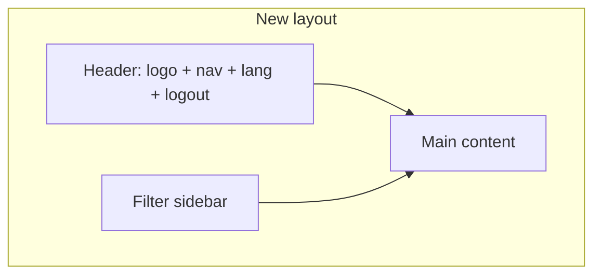

# v1.1 — UI Fixes and Improvements

## Current gaps (from codebase)

- Transaction form has `tag_ids` in state/API but **no tag picker in UI** ([`TransactionsPage.tsx`](frontend/src/pages/TransactionsPage.tsx))
- All forms are **inline cards**, not modals (accounts, transactions, categories, budgets, planned)
- Accounts are not clickable — no `/accounts/:id` route ([`App.tsx`](frontend/src/App.tsx))
- Category `parent` exists in backend ([`ledger/models.py`](backend/apps/ledger/models.py)) but UI only shows flat list with create/delete
- Tags API supports PATCH via `TagViewSet`, but frontend only has `create`/`delete` ([`api/client.ts`](frontend/src/api/client.ts))
- No i18n library or locale files
- Layout is left **nav sidebar** + main; filters live inside page content



---

## Phase 1 — Shared UI foundation

### 1.1 Modal system

Add reusable components under [`frontend/src/components/`](frontend/src/components/):

- `Modal.tsx` — overlay, title, close on Esc/backdrop, focus trap (minimal)
- `ModalForm.tsx` — wraps form with Save/Cancel footer

All create/update flows move into modals triggered by **Add** / **Edit** buttons; remove inline `<form className="card">` blocks from pages.

### 1.2 Layout refactor

Replace [`Layout.tsx`](frontend/src/components/Layout.tsx) structure:

| Zone | Content |
|------|---------|
| **Header** (full width) | App title, nav links (Dashboard, Transactions, Accounts, Categories, Budgets, Planned, Reports, Import), language switcher, Logout |
| **Body** (flex row) | Left: **filter sidebar** (250px, collapsible on mobile) · Right: `<Outlet />` |

Add `FilterSidebarContext` or pass filters via outlet context so each page registers its filter controls without duplicating layout chrome.

Update [`index.css`](frontend/src/index.css): `.app-header`, `.filter-sidebar`, `.content-area`; remove old `.sidebar` nav styles.

### 1.3 Extract shared forms

| Component | Used by |
|-----------|---------|
| `TransactionFormModal` | Transactions page, Account detail page |
| `AccountFormModal` | Accounts page |
| `CategoryFormModal` | Categories page |
| `TagFormModal` | Categories page |
| `BudgetFormModal` | Budgets page |
| `PlannedFormModal` | Planned page |

`TransactionFormModal` accepts optional `initialValues` (e.g. `{ account: 5 }`) for prefilled account.

---

## Phase 2 — Account detail page

### 2.1 Routing

Add route in [`App.tsx`](frontend/src/App.tsx):

```
/accounts/:accountId  →  AccountDetailPage
```

### 2.2 AccountDetailPage

New [`frontend/src/pages/AccountDetailPage.tsx`](frontend/src/pages/AccountDetailPage.tsx):

**Header block (main area, not app header):**
- Account icon, title, **balance** (from `Account.balance` API field)
- **Add transaction** button → opens `TransactionFormModal` with `account` prefilled and locked/disabled

**Transaction list:**
- Fetch `api.transactions.list({ account: accountId, ...sidebarFilters })`
- Reuse shared `TransactionList` component (see Phase 3)

**Make accounts clickable:**
- [`DashboardPage.tsx`](frontend/src/pages/DashboardPage.tsx) — card `onClick` → `navigate(/accounts/${id})`
- [`AccountsPage.tsx`](frontend/src/pages/AccountsPage.tsx) — same; remove inline create form → **Add account** opens modal

---

## Phase 3 — Transaction list and form improvements

### 3.1 Tags in transaction form

- Load tags via `api.tags.list()`
- Multi-select chip UI (toggle tags on/off) bound to `tag_ids`
- Optionally add read-only `tag_names` to [`TransactionSerializer`](backend/apps/ledger/serializers.py) for list display (small backend tweak)

### 3.2 Signed amounts (no type/status columns)

New `TransactionList` component shared by Transactions and Account detail:

| Column | Display |
|--------|---------|
| Date | localized |
| Description | category name, recipient, notes snippet, transfer arrow (`→ Account B` / `→ nowhere`) |
| Tags | chips |
| Amount | **signed**, color-coded |

**Signing rules** (helper `formatSignedAmount(tx, perspectiveAccountId?)`):

- `expense` → `−amount` (red)
- `income` → `+amount` (green)
- `transfer` on account detail: outflow `−`, inflow `+`; on global list show `±` based on source account or neutral with counterparty text
- Hide **Type** and **Status** columns entirely
- Remove status from create form; default `cleared` server-side (already default in model)

Remove status filter from sidebar (redundant per your request).

### 3.3 Transactions page

- Sidebar filters: date range, category, tag, type (keep type filter in sidebar only — useful for filtering, not display)
- Main: list + **Add transaction** button (modal)
- Row click or Edit icon → edit modal

---

## Phase 4 — Categories: nesting + must/need/want

### 4.1 Backend

Extend [`Category`](backend/apps/ledger/models.py):

```python
PRIORITY_MUST = "must"
PRIORITY_NEED = "need"
PRIORITY_WANT = "want"
priority = models.CharField(max_length=10, choices=..., null=True, blank=True)
```

- `priority` applies to **expense** categories only (nullable for income)
- Fix uniqueness: change `unique_together` from `(user, name)` to `(user, name, parent)` so sibling names can repeat under different parents
- Migration in `apps/ledger/migrations/`
- Update [`CategorySerializer`](backend/apps/ledger/serializers.py) to expose `priority`

### 4.2 Frontend

- **Tree view** for categories (indent by parent, build tree client-side from flat list)
- `CategoryFormModal` fields: name, icon, type (expense/income), **parent** (dropdown of eligible parents — exclude self/descendants on edit), **priority** (must/need/want — shown only when type=expense)
- Click category row → edit modal; delete with confirm
- Nested category picker in transaction form (indented options)

---

## Phase 5 — Editable tags

- Add `api.tags.update()` in [`api/client.ts`](frontend/src/api/client.ts) (backend already supports PATCH)
- Tag list: click → `TagFormModal` (name, color)
- Delete remains with confirm

Categories already have `api.categories.update` — wire to edit modal (Phase 4).

---

## Phase 6 — Internationalization (ru / en)

### 6.1 Setup

- Add `react-i18next` + `i18next`
- [`frontend/src/i18n/index.ts`](frontend/src/i18n/index.ts) — init with `en` and `ru` resources
- [`frontend/src/i18n/en.json`](frontend/src/i18n/en.json), [`frontend/src/i18n/ru.json`](frontend/src/i18n/ru.json)
- Detect language: `localStorage` key `locale` → fallback `navigator.language` → default `ru`
- Language toggle in app header (RU | EN)

### 6.2 Coverage

Replace hardcoded strings in:
- Layout nav, all pages, modals, filters, buttons, validation messages
- Use `t('key')` throughout; keep currency/numbers via `Intl.NumberFormat` with active locale

No backend i18n needed for v1.1 (UI-only); category/tag names are user data.

---

## Phase 7 — Convert remaining pages to modals

Apply modal pattern to pages not covered above:

| Page | Change |
|------|--------|
| [`AccountsPage.tsx`](frontend/src/pages/AccountsPage.tsx) | Add/Edit account modals; list only |
| [`BudgetsPage.tsx`](frontend/src/pages/BudgetsPage.tsx) | Add/Edit budget modals |
| [`PlannedPage.tsx`](frontend/src/pages/PlannedPage.tsx) | Add/Edit planned modals |
| [`CategoriesPage.tsx`](frontend/src/pages/CategoriesPage.tsx) | Fully replaced by tree + modals (Phase 4–5) |

Import and Reports pages: no create forms — layout/filter sidebar only where applicable.

---

## Implementation order (recommended)

1. Modal + Layout refactor (header nav, filter sidebar shell)
2. `TransactionFormModal` + `TransactionList` (signed amounts, tags)
3. `AccountDetailPage` + clickable accounts
4. Category backend migration + tree UI + edit
5. Tag edit modal
6. i18n pass across all components
7. Remaining pages → modals

---

## Out of scope (v1.1)

- Removing `status` from database (kept, hidden in UI, defaults to `cleared`)
- Multi-currency UI changes
- Account edit modal (optional follow-up — only create/delete today)

## Verification checklist

- [ ] Create transaction with tags from modal on account page (account prefilled)
- [ ] Dashboard account card opens account detail with correct balance
- [ ] Transaction amounts show signs; no type/status columns
- [ ] Create nested category with must/need/want; edit and delete work
- [ ] Edit tag name/color
- [ ] Switch RU/EN — all nav, labels, buttons translated
- [ ] Filters appear in left sidebar; nav in top header on desktop and mobile
